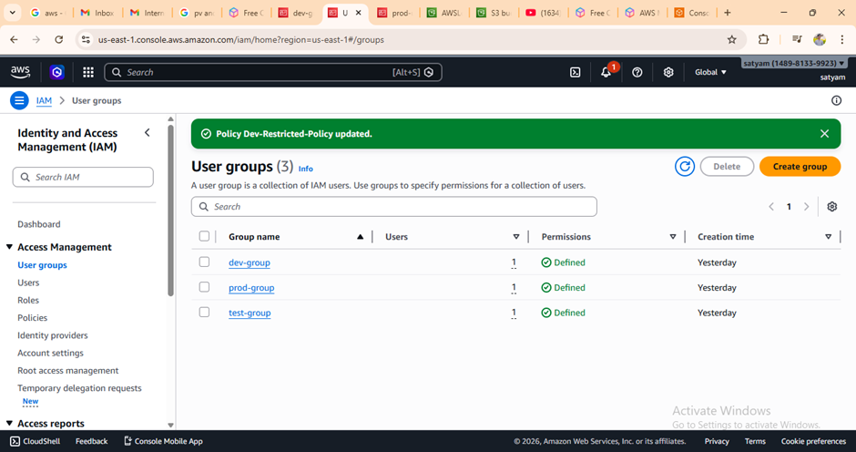
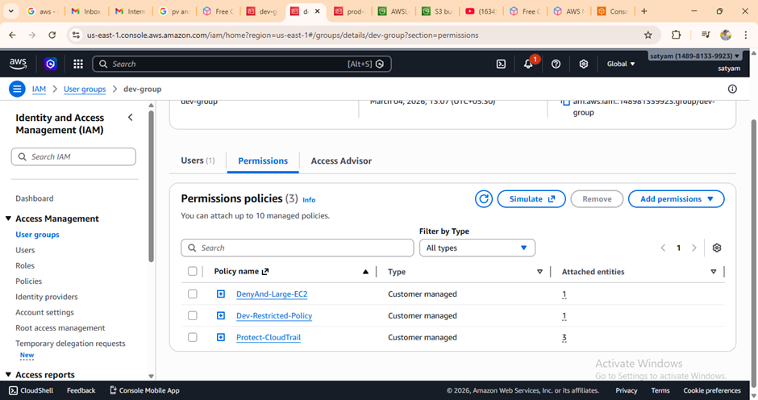
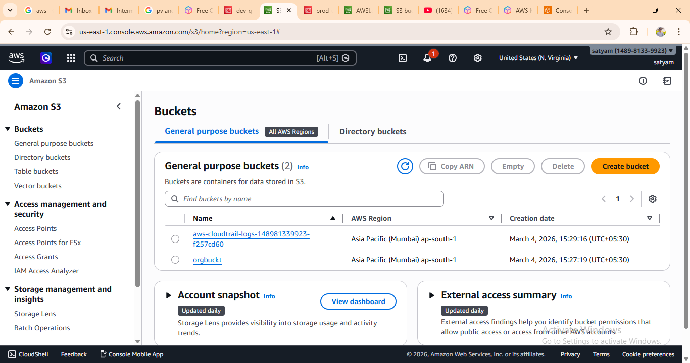
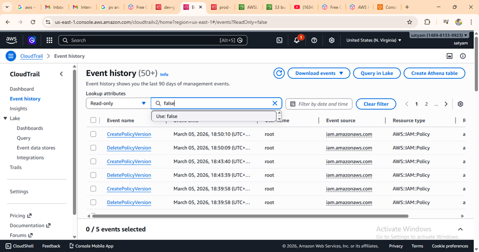
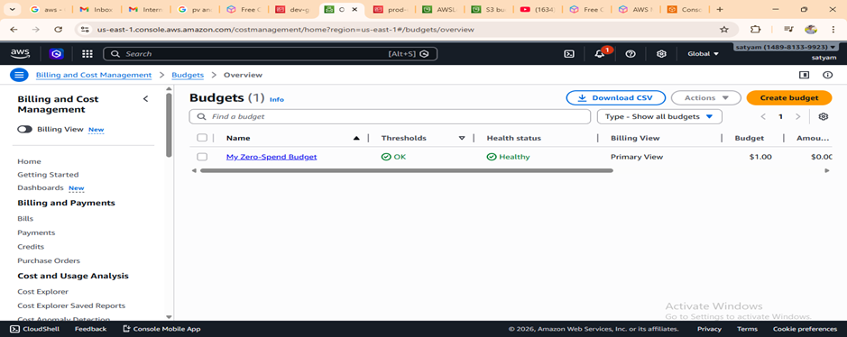
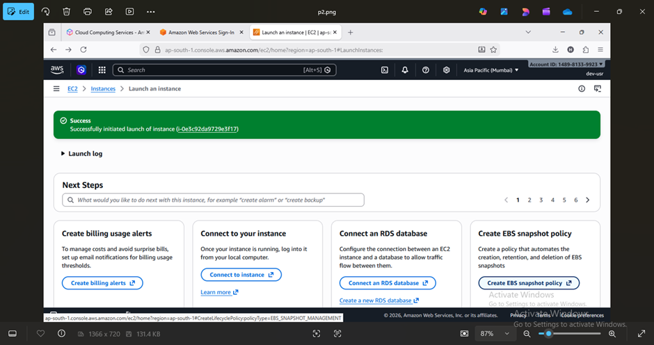
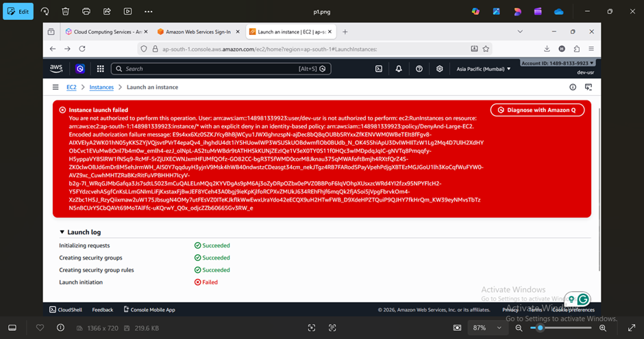

##   Project -1   AWS Governance Implementation using IAM Policies, CloudTrail and Budget Monitoring

### Project Overview
This project demonstrates how centralized governance can be implemented across AWS accounts to enforce security, cost control, and compliance policies. In a growing enterprise environment, multiple teams often use different AWS accounts. Without governance controls, developers may accidentally launch expensive resources or modify critical security configurations.
This project simulates a governance model where restrictions are applied to development environments while maintaining security monitoring and cost control.
The governance model is implemented using AWS services such as AWS Organizations, IAM policies, and CloudTrail logging.
________________________________________
## Objective
The objective of this project is to design and implement a governance framework that controls how AWS resources are created and managed.
The key goals are:
•	Prevent developers from launching expensive EC2 instance types.
•	Ensure CloudTrail logging cannot be disabled.
•	Enforce centralized security and compliance policies.
•	Monitor usage and enable cost alerts.

## Architecture Overview

### Enterprise Structure

```
Root Organization
│
├── Development Environment
├── Testing Environment
└── Production Environment
```

Each environment follows governance rules defined through policies.


## Technologies Used
•	IAM (Identity and Access Management)

•	Amazon EC2

•	AWS CloudTrail

•	AWS Budgets


## Step 1: IAM User and Group Setup
Create IAM users to simulate different teams in the organization.
Steps:
1.	Open AWS Console
2.	Navigate to IAM
3.	Create Users:
o	dev-user
o	prod-user
4.	Create a User Group:
o	dev-group
5.	Add dev-user to dev-group



This simulates a development team account.
________________________________________
## Step 2: Create Governance Policy for Development Team

The development team should only be allowed to launch small EC2 instance types to prevent unnecessary cost usage.

### Policy Logic

**Allowed Instance Types**
- t2.micro  
- t3.micro  
- t2.small  
- t3.small  

**Denied Instance Types**
- medium  
- large  
- xlarge  

### Dev Governance Policy

```json
{
 "Version": "2012-10-17",
 "Statement": [
  {
   "Sid": "AllowEC2BasicOperations",
   "Effect": "Allow",
   "Action": [
    "ec2:RunInstances",
    "ec2:DescribeInstances",
    "ec2:DescribeImages",
    "ec2:DescribeKeyPairs",
    "ec2:CreateKeyPair",
    "ec2:DescribeSecurityGroups",
    "ec2:CreateSecurityGroup",
    "ec2:AuthorizeSecurityGroupIngress",
    "ec2:DescribeVpcs",
    "ec2:DescribeSubnets",
    "ec2:DescribeInstanceTypes",
    "ec2:CreateTags"
   ],
   "Resource": "*"
  },
  {
   "Sid": "DenyLargeInstances",
   "Effect": "Deny",
   "Action": "ec2:RunInstances",
   "Resource": "*",
   "Condition": {
    "StringLike": {
     "ec2:InstanceType": [
      "*.medium",
      "*.large",
      "*.xlarge"
     ]
    }
   }
  }
 ]
}
```



## Step 3: Enable CloudTrail for Security Monitoring
### CloudTrail records all API activity in the AWS account.
Steps:
1.	Open AWS Console
2.	Navigate to CloudTrail
3.	Create a new Trail
4.	Enable Multi-Region logging
5.	Store logs in an S3 bucket
CloudTrail ensures that all actions performed by users are recorded for auditing and security.


  


## Step 4: Setup Budget Alert for Cost Monitoring
### To monitor spending and receive alerts when costs increase.
Steps:
1.	Open Billing Dashboard
2.	Go to Budgets
3.	Create a new budget
4.	Select Zero Spend Budget
5.	Set threshold alert at $0.01
6.	Enter email address for notifications
This helps track unexpected cost increases



## Step 5: Validation and Policy Enforcement
### Validation is performed by attempting restricted actions.
Test cases:
1.	Login using dev-user
2.	Launch EC2 instance with instance type:
o	t3.micro → Allowed
3.	Attempt to launch:
o	t3.medium → Access Denied
This confirms that governance policies are working correctly. 
### Small size instance

### Large size instance



## Risk Mitigation Strategy
This governance model reduces the following risks:

Uncontrolled Cloud Costs
Developers cannot launch large EC2 instances.

Security Monitoring
CloudTrail ensures all actions are logged.

Unauthorized Infrastructure Changes
Policies prevent critical resource modifications.
________________________________________
## Governance Benefits
Centralized control across accounts

Reduced infrastructure cost

Improved security auditing

Consistent compliance enforcement

## Conclusion
This project demonstrates how governance policies can be implemented in AWS to enforce security, cost, and operational standards. By combining IAM policies, CloudTrail logging, and budget alerts, organizations can maintain centralized control over cloud environments while enabling teams to work efficiently.

## Author

**Hrishikesh Khandagale**  
AWS Governance Project


